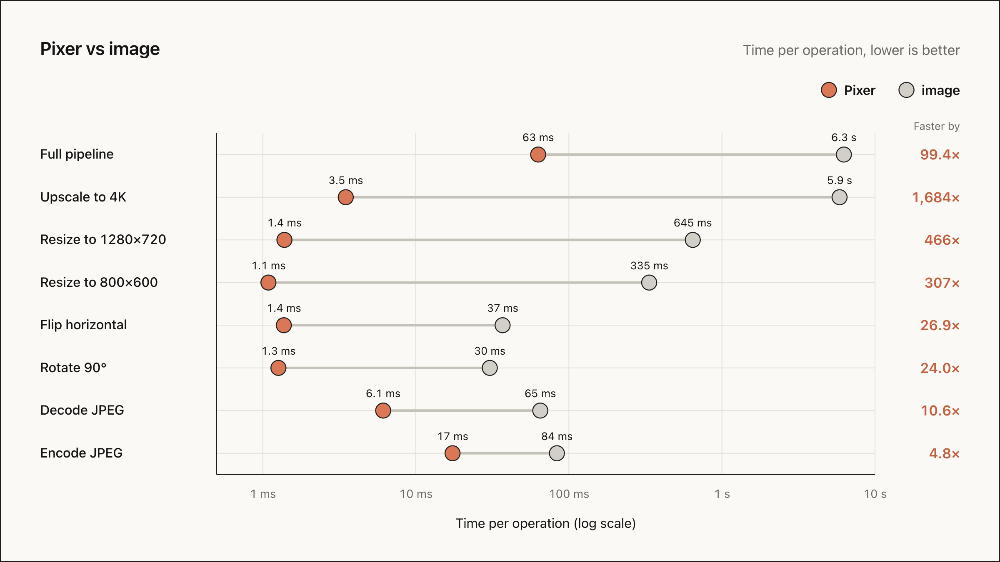

# Benchmarks

Compares `pixer` (Rust-backed) with the pure Dart `image` package.

## Running Benchmarks

```bash
dart run bin/main.dart
```

Results are printed and saved to `benchmark_results.json`.

## Benchmark Results



_Last updated: October 4, 2026. Apple M4 Pro (12 cores), Dart 3.13.0, pixer built from source._

Times are per operation, in milliseconds.

| Operation                         | pixer | image   | Speedup   |
| --------------------------------- | ----- | ------- | --------- |
| **Resize to 800x600**             | 1.1   | 334.7   | **307x**  |
| **Resize to 1280x720**            | 1.4   | 645.1   | **466x**  |
| **Resize to 3840x2160**           | 3.5   | 5,868.9 | **1684x** |
| **Load (decode JPEG)**            | 6.1   | 65.0    | **10.6x** |
| **Encode JPEG (quality 85)**      | 17.4  | 83.6    | **4.8x**  |
| **Rotate 90°**                    | 1.3   | 30.4    | **24.0x** |
| **Flip Horizontal**               | 1.4   | 36.9    | **26.9x** |
| **Decode, upscale to 4K, encode** | 63.0  | 6,260.7 | **99.4x** |

The input is a Full HD (1920x1080) JPEG decoded from memory. Resizes produce exact dimensions with a
cubic filter in both libraries (`FilterTypeEnum.CatmullRom` and `Interpolation.cubic`).

### Notes

- Resize gains come from SIMD and from splitting large images across CPU cores.
- Load and encode are bound by the JPEG codecs, so gains there are smaller.
- Numbers depend on the CPU and core count, so rerun on your target hardware.
